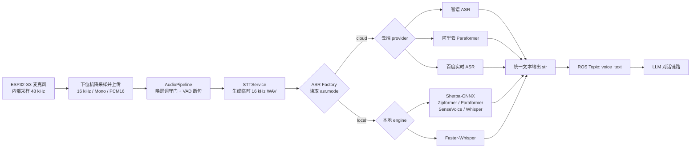

# Wali X3 Brain 🧠

这是一个基于 ROS2 (Humble) 和 地平线旭日 X3 派 (Sunrise X3 Pi) 打造的仿生机器人大脑中枢。本项目为“瓦力”机器人赋予了视觉追踪、多模态语音交互、手柄接管以及物理防碰撞的能力。

## 🌟 核心特性

- 🤖 **仿生视觉追踪 (AI BPU)**：深度整合地平线 TogetherROS，实现无缝的人体/人脸追踪。独创“虚假扭头”仿生视效及双舵机补偿仰俯算法。
- 🎙️ **可切换语音识别**：支持基于 Qwen-Omni 的端到端音频交互，也支持 `ASR → LLM → TTS` 链路；ASR 可在智谱、阿里云、百度智能云与多种本地离线模型之间切换。
- 🎮 **零侵入物理接管**：通过高频发布中枢，使用游戏手柄可随时实现最高优先级的纯物理控制（摇杆差速底盘、线性扳机压感眼球），并自动屏蔽大模型的行动指令。
- 🛡️ **小脑安全守护**：底层 `sequence_ros_node` 提供 50Hz 动作插值平滑，并内置严格的物理干涉检测（例如转头时眼睛自动抬高防止碰撞）。

## ⚙️ 硬件与环境要求

1. **主板**：地平线 旭日 X3 派 (Sunrise X3 Pi)
2. **系统**：Ubuntu 22.04 LTS (预装地平线 TogetherROS Humble)
3. **摄像头**：支持普通 USB 摄像头 (UVC) 或官方 MIPI 排线摄像头。
4. **控制板**：基于 ESP32/Arduino，通过串口与旭日派通信，挂载 PCA9685 (舵机) 和 TB6612 (电机驱动)。
5. **手柄**：标准 USB 无线游戏手柄。

## 🚀 安装与配置

### 1. 旭日派 AI 模型安装
视觉节点强依赖于地平线 BPU 硬件加速模型，必须确保系统内已安装官方模型包：
```bash
sudo apt update
sudo apt install tros-dnn-node-example
```

### 2. 编译本项目
将代码克隆到你的 ROS2 工作空间（如 `~/your_workspace/src/`）下：
```bash
cd ~/your_workspace
colcon build --packages-select wali_x3_brain
source install/setup.bash
```

### 3. ASR 运行依赖

先安装系统音频依赖，再按使用的语音模式安装对应清单：

```bash
sudo apt install -y libportaudio2 portaudio19-dev ffmpeg python3-opencv

# 键盘调试、LLM、TTS 和通用硬件链路
python3 -m pip install -r requirements.txt

# 使用任一云端 ASR 时（智谱、阿里云或百度）
python3 -m pip install -r requirements-cloud-asr.txt

# 使用本地 ASR、本地 VAD 或 sherpa-onnx 唤醒词时
python3 -m pip install -r requirements-local-asr.txt

# 仅在 hardware.backend=ubuntu_i2c 时需要
python3 -m pip install -r requirements-i2c.txt
```

> [!NOTE]
> 唤醒词与 ASR 是两套独立模块。即使 ASR 使用云端服务，只要启用了唤醒词，仍需要安装 `sherpa-onnx`。

开发机可安装 `requirements-dev.txt`。仓库的 GitHub Actions 会在每次
push 和 pull request 时安装这组依赖并运行 `python -m unittest discover -s tests -v`。

## 🎙️ ASR 云端 / 本地引擎配置

### 设计目标

所有 ASR 引擎都保留同一个整句识别接口：

```python
recognize(wav_path: str, sample_rate: int = 16000) -> str
```

因此更换云端服务商或本地模型时，只替换 ASR 适配器，不需要修改唤醒词、VAD、LLM、TTS 或 ROS Topic。识别成功统一返回纯文本，识别失败统一返回空字符串。

支持实时音频传输的适配器还可以实现 `start_stream()`、`accept_audio()` 和
`finish_stream()`。当前百度实时 ASR 会在 VAD 检测到开口后边采集边发送音频，断句时只获取并发布一次最终文本，避免录完后再按录音时长重放上传。如果实时连接失败，系统自动回退到上述完整 WAV 接口；其他云端和本地引擎继续使用整句识别，不受影响。

ASR 适配器还提供 `warmup()` / `close()` 生命周期。百度在启动、唤醒和对话播放期间异步准备一条尚未发送 `START` 的待命 WebSocket，使用前检查有效期，失效时自动重连；一句识别结束后关闭已使用的会话，不会把旧会话用于下一句话。智谱使用持久 HTTP Session 复用 TCP/TLS 连接，本地模型实例则持续常驻内存。



> [!IMPORTANT]
> ASR 输入固定为 `16 kHz / 16-bit / 单声道 PCM WAV`。ESP32-S3 的麦克风虽然内部以 48 kHz 采样，但上传给旭日派前会降采样到 16 kHz。48 kHz 只用于 TTS 和提示音播放输出。

`wake_word.awake_timeout` 表示一轮对话中的用户无声等待时间。完成一句 ASR 后，计时会在 LLM 请求、TTS 合成和音频播放期间暂停；最后一段 AI 语音真正播放完成后，才重新开始计时。

`vad.silence_sec` 控制检测到人声后等待多少秒静音才结束一句，默认 `0.5` 秒，可在 Web 页面的“VAD 语音断句”中设置为 `0.3`～`2.0` 秒。数值越小响应越快，但过小可能切断说话中的自然停顿。

### 使用 Web 页面配置

启动配置服务：

```bash
python3 services/web_server.py
```

浏览器打开 `http://<旭日派IP>:8080`，进入“对话模式 → ASR 语音识别”，选择“云端服务”或“本地离线模型”。页面只展示当前引擎需要的字段，并在保存前检查参数类型、模型文件和模型目录是否存在。

保存后的配置写入 `core/config.yaml`。ASR 适配器在节点启动时创建，修改配置后需要重启主脑：

```bash
python3 launch_nodes.py --real-stt
```

API Key 不会回传到页面；密钥输入框留空时保留原值。不要把真实密钥写入 README、Issue、日志或提交到公开仓库。

### 云端 ASR 参数

| 服务商 | `provider` | 必填参数 | 可选参数 | 额外依赖 |
| --- | --- | --- | --- | --- |
| 智谱 AI | `zhipu` | `model`、`api_key`、`url` | - | `requests` |
| 阿里云 Paraformer | `aliyun` | `model`、`api_key` | - | `dashscope` |
| 百度实时语音识别 | `baidu` | `app_id`、`api_key`、`dev_pid`、`cuid`、`url` | `lm_id`；使用方言 PID `15376` 时还需 `user` | `websocket-client` |

推荐使用按服务商分组的新配置格式：

<details>
<summary>智谱云端 ASR 示例</summary>

```yaml
pipeline:
  mode: asr_llm

asr:
  mode: cloud
  provider: zhipu
  zhipu:
    model: GLM-ASR-2512
    api_key: YOUR_API_KEY
    url: https://open.bigmodel.cn/api/paas/v4/audio/transcriptions
```

</details>

<details>
<summary>百度实时 ASR 示例</summary>

```yaml
pipeline:
  mode: asr_llm

asr:
  mode: cloud
  provider: baidu
  baidu:
    app_id: 12345678
    api_key: YOUR_API_KEY
    dev_pid: 15372
    cuid: wali-x3
    url: wss://vop.baidu.com/realtime_asr
```

</details>

### 本地 ASR 模型要求

| 本地引擎 | `engine` | 模型文件或目录 | 其他参数 |
| --- | --- | --- | --- |
| Sherpa Zipformer | `sherpa_onnx_zipformer` | `encoder`、`decoder`、`joiner`、`tokens` | `num_threads`：1-64 |
| Sherpa Paraformer | `sherpa_onnx_paraformer` | `model`、`tokens` | `num_threads`：1-64 |
| Sherpa SenseVoice | `sherpa_onnx_sensevoice` | `model`、`tokens` | `language`、`use_itn`、`num_threads` |
| Sherpa Whisper | `sherpa_onnx_whisper` | `encoder`、`decoder`、`tokens` | `language`、`num_threads` |
| Faster-Whisper | `faster_whisper` | `model_path` 模型目录 | `language`、`device`、`compute_type` |

模型路径可以是绝对路径，也可以是相对于项目根目录的路径。Web 服务保存配置时会检查路径；主脑启动时会再次校验并解析为绝对路径。

<details>
<summary>Sherpa-ONNX Zipformer 示例</summary>

```yaml
pipeline:
  mode: asr_llm

asr:
  mode: local
  engine: sherpa_onnx_zipformer
  sherpa_onnx_zipformer:
    encoder: models/asr/zipformer/encoder.onnx
    decoder: models/asr/zipformer/decoder.onnx
    joiner: models/asr/zipformer/joiner.onnx
    tokens: models/asr/zipformer/tokens.txt
    num_threads: 2
```

</details>

<details>
<summary>Faster-Whisper 示例</summary>

```yaml
pipeline:
  mode: asr_llm

asr:
  mode: local
  engine: faster_whisper
  faster_whisper:
    model_path: models/asr/faster-whisper
    language: zh
    device: cpu
    compute_type: int8
```

</details>

> [!WARNING]
> 本地 ASR 模型文件不随项目提供。Sherpa 模型必须与 `sherpa_onnx.OfflineRecognizer` 对应接口兼容。项目现有的 `models/sherpa-onnx` 是唤醒词模型，不能直接作为通用 ASR 模型使用。

## 🎮 启动指南

系统的启动分为**“视觉感知端”**和**“瓦力大脑端”**两个独立的部分。

### 配置网页

项目内置了一个零额外依赖的 `config.yaml` 配置网页。默认只监听本机：

```bash
python services/web_server.py
```

浏览器访问 `http://<旭日派IP>:8080`（本机调试也可用 `http://127.0.0.1:8080`）。默认监听所有网络接口，默认访问令牌为 `123456`。页面右上角提供“修改令牌”按钮，修改后立即生效并写入 `config.yaml`，重启后仍然有效。页面将 ASR、LLM、唤醒词、TTS 和系统提示词归在“对话模式”中，可选择 `ASR → LLM → TTS` 或多模态 LLM；ASR 的引擎、参数和模型文件要求见上方“ASR 云端 / 本地引擎配置”。每张配置卡片独立保存。服务端只合并提交的模块，保存前仍会校验完整配置，再原子替换 `core/config.yaml`。已有 API Key 不会回传到网页，密钥输入框留空会保留原值。ASR 配置在重启主脑后生效。

“硬件”页面可以为三类物理 USB 分配角色：摄像头 USB、屏幕/运动 USB、语音 USB（麦克风、扬声器和声源定位）。点击“刷新设备”后选择当前设备并独立保存。配置使用 VID/PID 加序列号识别设备；没有序列号时使用物理 USB 端口路径，因此 `/dev/ttyACM*`、`/dev/video*` 或音频卡编号变化不会影响匹配。未配置某个角色时继续使用原有代码默认逻辑。运行中修改配置或拔插设备后，串口、DOA、音频和摄像头节点会自动重新发现并恢复，无需重启主程序。

网页保存后的配置结构示例：

```yaml
usb_devices:
  camera:
    vendor_id: "1234"
    product_id: "5678"
    serial_number: camera-001
  screen_motion:
    vendor_id: "303a"
    product_id: "1001"
    serial_number: screen-001
  voice:
    vendor_id: "abcd"
    product_id: "0001"
    port_path: 1-2
```

配置服务也会跟随日常使用的节点启动器自动启动，无需再单独运行一次：

```bash
python launch_nodes.py --real-stt
```

`launch_nodes.py` 会把同一个配置服务作为受管子进程启动，页面地址为 `http://<旭日派IP>:8080`，主程序退出时网页服务也会一起停止。传入 `--no-web` 可以禁用。独立调试和主程序运行不要同时占用同一个端口；需要并行运行时，可给独立服务指定其他端口，例如 `python services/web_server.py --host 127.0.0.1 --port 8765`。

默认局域网访问令牌为 `123456`。页面右上角可修改本次访问使用的令牌，并会在当前浏览器会话中记住。如果要修改服务端实际接受的令牌，在启动前覆盖环境变量：

```bash
export WALI_CONFIG_HOST=0.0.0.0
export WALI_CONFIG_TOKEN="换成你自己的ASCII令牌"
python services/web_server.py
```

让配置服务随主程序启动并开放到局域网（默认已经如此）：

```bash
export WALI_CONFIG_HOST=0.0.0.0
export WALI_CONFIG_TOKEN=123456
python launch_nodes.py --real-stt
```

打开 `http://<旭日派IP>:8080`，在页面右上角输入同一个令牌。大多数节点只在启动时读取配置，因此保存后需要在确保运动机构安全的前提下重启主脑。

### 第一步：启动视觉 AI 节点 (依赖地平线 BPU)
旭日派强大的地方在于自带视觉算法包。打开终端，输入以下命令：

**如果你使用 USB 摄像头 (UVC)：**
```bash
source /opt/tros/humble/setup.bash
export CAM_TYPE=usb
ros2 launch dnn_node_example dnn_node_example.launch.py
```
*(启动成功后，浏览器访问 `http://<旭日派IP>:8000` 即可查看带追踪框的实时画面)*

### 第二步：启动瓦力大脑中枢
打开一个新的终端：
```bash
source /opt/tros/humble/setup.bash
source ~/your_workspace/install/setup.bash

# 启动大脑并开启视觉跟随功能
ros2 launch wali_x3_brain launch_nodes.py --tracking
```

#### 启动参数选项 (`launch_nodes.py`)
- `--tracking`：开启视觉追踪节点（监听地平线 BPU 输出）。
- `--voice-chat`：使用大模型端到端语音交互（Qwen-Omni）。
- `--real-stt`：启动 `ASR → LLM → TTS` 链路，实际 ASR 引擎由 `core/config.yaml` 或 Web 页面中的 `asr.mode`、`provider` / `engine` 决定。
- `--keyboard-stt`：使用键盘输入文字模拟语音识别（调试用）。
- `--no-serial`：不启动屏幕/下位机串口节点；板载 I²C 后端仍可运行。
- `--no-hardware`：不启动舵机/电机硬件后端，保留其他节点用于调试。
- `--no-web`：不启动 `config.yaml` 配置网页。

舵机和履带的硬件后端在配置网页“硬件 → 运动硬件后端”中选择：

- `serial_mcu`：默认模式，通过 USB 串口把 PCA9685 数据发送给 ESP32 下位机。
- `ubuntu_i2c`：由旭日派 Ubuntu 通过板载 I²C 直接控制 PCA9685。该模式需要启用对应 I²C 总线，并安装 `smbus2` 与 `adafruit-circuitpython-pca9685`。

## 🧠 核心架构说明

### 视觉双模式系统 (`wali_tracking_node.py`)
为了适配“摄像头纯靠脖子仰俯，左右平移全靠底盘转弯”的独特机械结构，设计了两种状态：
1. **模式 1 (跟随模式 - body_follow)**：纯底盘出击。根据身体大小前进后退，根据左右偏移差速旋转。同时脑袋 (`head_yaw`) 模拟转向产生“仿生看人”效果。
2. **模式 2 (注视模式 - face_follow)**：底盘锁定刹车。脖子双舵机 (`neck_top` & `neck_bottom`) 自动反向补偿实现仰俯追踪。丢失目标自动原地打转搜寻；仅识别到身体时自动上扬镜头寻找人脸。

### 手柄控制映射 (`joy_control_node.py`)
- **左摇杆**：控制履带底盘前进/后退/差速转向。
- **右摇杆**：控制头部 (`head_yaw` 和 脖子仰俯)。
- **L2/R2 扳机**：0~100% 线性控制左眼/右眼抬起高度，松开自动降下（还原呆萌感）。
- **十字键 / L1R1**：控制手臂和眉毛。自带 **3秒智能倒计时复位**，按下抬起，松开 3 秒后自动降回原位。
- **A/B/X/Y 键**：一键触发预设宏剧本（高兴、失落、打招呼等）。

## 📝 消息话题 (Topics)
- `/hobot_dnn_detection`：来自地平线节点的 AI 识别框数据。
- `/servo_cmd`：底层的舵机驱动指令 (JSON)。
- `/motor_cmd/joystick`、`/motor_cmd/tracking`、`/motor_cmd/autonomy`：手柄、视觉跟踪和自主动作的分源电机指令。
- `/motor_cmd`：`motion_arbiter_node` 按“手柄 > 跟踪 > 自主动作”选出的唯一硬件电机指令；上游心跳超过 300ms 未刷新时自动停车。
- `/action_cmd`：小脑 API，接收大模型和手柄下发的组合动作、模式切换和 `manual_servo` 直驱指令。
